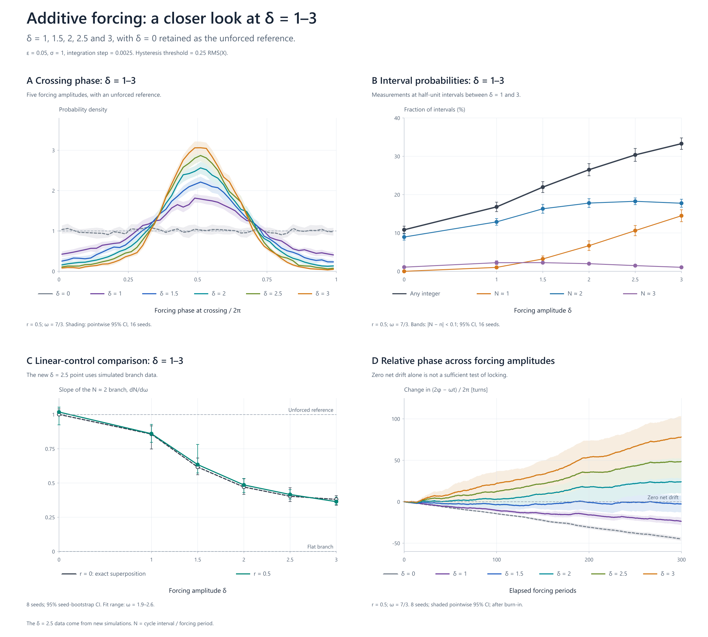
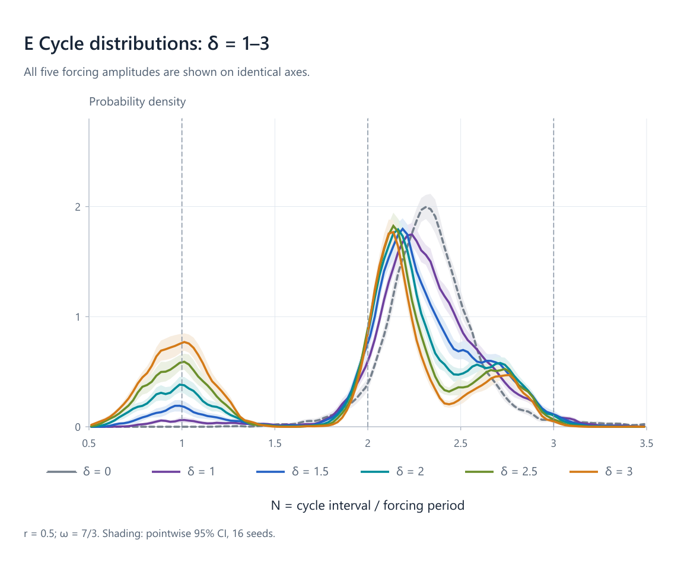

# Additive forcing of a stochastic oscillator

Research catalogue, numerical follow-up, simulation records, analysis and figures for

$$dX = V\,dt,$$

$$dV = -(X+\epsilon V)\,dt + \sqrt{\epsilon(\sigma^2+2rX^2)}\,dB + \delta\sin(\omega t)\,dt.$$

The follow-up simulations use the Itô interpretation, with baseline parameters epsilon = 0.05 and sigma = 1. Cycle intervals are expressed in multiples of the forcing **period**, 2 pi / omega.

## Start here

- [Original research catalogue](research/additiveforcingresultscatalogue.pdf)
- [Follow-up findings, methods and limitations](outputs/forcing_followup/report.md)
- [Latest figures: delta = 1, 1.5, 2, 2.5 and 3](outputs/conclusion_graphs_1_to_3/)
- [Latest figure captions and simulation details](outputs/conclusion_graphs_1_to_3/captions.md)
- [Download the latest figures and plotted data](outputs/conclusion_graphs_1_to_3/graphs_delta_1_to_3.zip)





## Scope of the findings

In the explored parameter range, forcing concentrates crossing phases and changes the distribution of cycle intervals, including increasing the frequency of intervals near integer forcing periods. Branch flattening is also reproduced by the r = 0 linear stochastic superposition control. These observations alone do not establish attraction to persistent integer-period oscillations. Near-zero ensemble-mean relative-phase drift, including the delta = 1.5 comparison, is not sufficient evidence of locking.

The follow-up also examines missed crossing opportunities, matched-noise phase perturbations, time-step sensitivity and crossing-threshold sensitivity. See the report for the scope and limitations of each diagnostic. The delta = 2.5 results in the latest figures were newly simulated, not interpolated.

## Repository contents

| Folder | Contents |
| --- | --- |
| `research/` | Original user-provided PDF catalogue |
| `work/` | C simulator, Python analysis and plotting scripts, reference notebook extraction, PDF text/page extracts and intermediate results |
| `work/runs/` | Saved simulation records, including focal trajectories, frequency sweeps, time-step checks, perturbation experiments and the added delta = 2.5 runs |
| `outputs/forcing_followup/` | Main report, numerical summaries, compact event data, validation and original reproduction archive |
| `outputs/conclusion_graphs/` | Earlier figure set, retained for completeness |
| `outputs/conclusion_graphs_1_to_3/` | Revised figures, vector SVGs, plotted data, captions and download archive |

Historical outputs include delta = 4; the revised figure set focuses on delta = 1–3 with delta = 0 as a reference. Numerical arrays and existing ZIP bundles are included directly in Git. Regenerable Python caches and the compiled simulator library are excluded; the C source is included.

## Reproduction

See the [original reproduction notes](outputs/forcing_followup/README.md) and [simulation manifest](outputs/forcing_followup/manifest.json). This repository additionally includes the saved full focal trajectories and the later amplitude refinement, beyond the contents of the original reproduction ZIP.

The scripts retain the Windows environment paths used for this research. The simulator expects GCC runtime libraries in `C:/msys64/ucrt64/bin`; the charts use Windows Segoe UI fonts, and the PNG renderer references the original installation path of the Node `sharp` package. Adjust those paths for another installation. Python dependencies include NumPy, SciPy, Pillow and ReportLab; PNG rendering also uses Node and Sharp. The archived files are usable without rerunning the simulations.

Build the simulator from the repository root before running scripts that import it:

```powershell
gcc -O3 -shared -o work/forcing.dll work/forcing.c -lm
```

The original experiment and validation commands are listed in the reproduction notes. With the existing simulation records and summaries present, the later amplitude refinement and figures can be regenerated with:

```powershell
python work/refine_amplitudes.py
python work/conclusion_figures_refined.py
node work/render_conclusion_figures.cjs conclusion_graphs_1_to_3
```

The follow-up implementation is an independent analysis of the catalogue's model; it is not represented as the catalogue's original simulation implementation.
