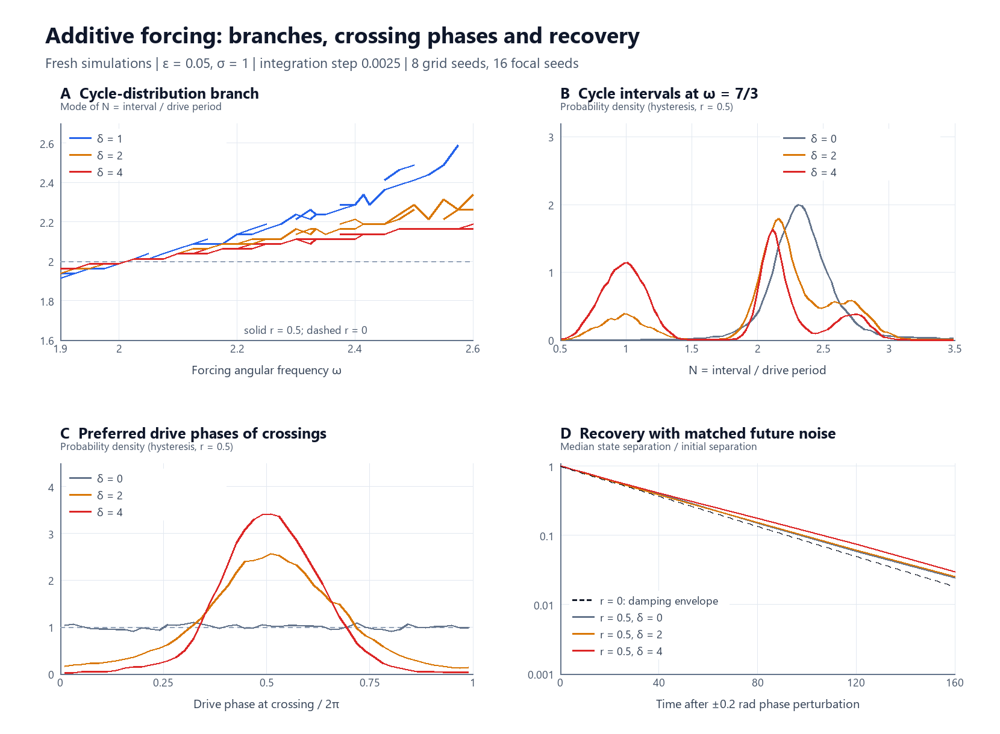
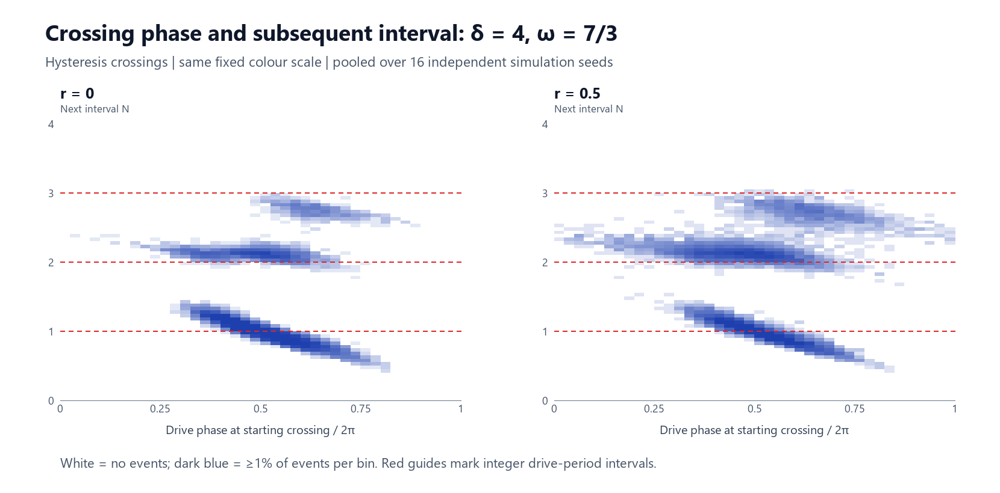

# Additive forcing: three follow-up experiments

**Finding:** additive forcing produces a reproducible preference for particular crossing phases and enriches intervals near integer drive periods. The branch flattening is already present in the exactly linear stochastic control. The phase-perturbation experiment does not show additional contraction caused by forcing. These results support phase-selective event timing, with skipped drive-period opportunities, rather than sustained 2:1 entrainment in the focal cases tested.

These are fresh simulations of the SDE supplied in the conversation, not a re-analysis of the catalogue's original cycle-event files. A related notebook, `parametric_forcing.ipynb`, confirmed the equation and update ordering; its code was inspected but not executed. The catalogue's original event arrays and branch-extraction implementation were not available.

## Model and experiment design

The simulated Itô system was

\[
dX=V\,dt,\qquad
dV=-(X+\epsilon V)\,dt+\sqrt{\epsilon(\sigma^2+2rX^2)}\,dB
+\delta\sin(\omega t)\,dt.
\]

All primary runs used epsilon = 0.05, sigma = 1, timestep 0.0025, total time 4000, burn-in 1000, and initial state (X,V) = (1,0). Velocity was updated first using the old position for the drift and diffusion, then position was advanced with the new velocity. No amplitude rescaling was used.

| Experiment | Design |
|---|---|
| Branch grid | r = 0 and 0.5; delta = 0, 1, 1.5, 2, 3, 4; 29 frequencies from 1.9 to 2.6 in steps of 0.025, plus 7/3 and 1 + sqrt(2); 8 independent seeds: 2,976 runs |
| Focal replication | Same r and delta values at omega = 7/3; 8 additional seeds: 96 runs, giving 16 seeds per focal parameter setting when combined with the grid |
| Exact superposition | Independently construct unforced stochastic trajectory plus deterministic numerical response at every r = 0 grid point and seed: 1,488 reconstructions |
| Step-size refinement | r = 0, 0.5; delta = 0, 2, 4; omega = 7/3; dt = 0.005, 0.0025, 0.00125; 4 seeds, with nested increments of the same Brownian paths: 72 runs |
| Phase perturbations | r = 0, 0.5; delta = 0, 1.5, 2, 4; omega = 7/3; 120 initial states per setting, each perturbed by +0.2 and -0.2 radians; future duration 160: 1,920 perturbation/reference comparisons |

The generator was NumPy's default PCG64 generator. Grid seeds were 101–108, additional focal seeds 201–208, and convergence seeds 301–304. Within a seed, all grid cells shared Brownian increments. Different seed numbers represented independent runs.

Upward zero crossings were interpolated between integration steps, before thinning. Each crossing retained the minimum position since the preceding raw crossing. This allowed application of a Schmitt trigger after measuring the complete post-burn-in RMS. The main hysteresis threshold was 0.25 RMS(X); factors 0.1 and 0.5 were also tested. Raw-crossing results are supplied separately.

Intervals are N = omega times interval / (2 pi). "Near integer" means distance from the nearest integer less than 0.1; individual bands use |N - n| < 0.1. Statistics below are equal-weight averages across simulation seeds, not counts pooled and treated as independent observations. Focal confidence intervals are 95% Student-t intervals across the 16 seed-level estimates. They quantify simulation variability under the stated design, not model uncertainty or a simultaneous confidence bound over the parameter grid.

## 1. Preferred crossing opportunities and skipped drive periods

At omega = 7/3, r = 0.5, the main hysteresis results were:

| Forcing delta | Intervals near an integer, % (95% CI) | Crossing-phase resultant R_event (95% CI) | Mean N (95% CI) | Number of intervals |
|---|---:|---:|---:|---:|
| 0 | 10.8 (9.9–11.8) | 0.027 (0.020–0.035) | 2.448 (2.432–2.464) | 7,264 |
| 2 | 26.5 (24.9–28.1) | 0.561 (0.541–0.581) | 2.107 (2.070–2.144) | 8,452 |
| 4 | 37.7 (36.3–39.1) | 0.752 (0.739–0.764) | 1.649 (1.600–1.698) | 10,823 |

Here R_event = |mean exp(i omega t_k)| for crossing times t_k. Zero denotes no first-harmonic phase concentration; one denotes identical drive phase at all crossings. Its small positive unforced value includes finite-sample bias. Forced crossings concentrated around drive phase pi, whereas the unforced reference phases were approximately uniform.

The effect was also present at neighbouring frequencies: for r = 0.5, delta = 4, near-integer fractions at omega = 2.3, 2.4, 2.5 were approximately 39.9%, 34.1%, 31.8%, respectively, with phase resultants 0.751, 0.737, 0.736. It is not confined to the exact 7/3 ratio.

Across complete drive periods at omega = 7/3, delta = 4, approximately 60.8% contained one accepted crossing and 39.2% contained none. No complete drive period contained multiple accepted hysteresis crossings in these runs. Preferred crossing phases combined with such empty periods are consistent with opportunities that are sometimes skipped. Empty periods alone would not establish gating: the unforced oscillator also has empty drive periods simply because it is slower.

The joint plots show branches near one, two, and roughly three drive periods, whose locations depend on the phase of the starting crossing. The same structure exists at r = 0. The branches have finite width and are not exact masses at integer N.

The two-period band is not persistently occupied. At delta = 2, its marginal occupancy was 17.8%, and the probability that a near-two-period interval was followed by another was 23.9% (95% CI 20.2–27.6%). At delta = 4 those values were 15.6% and 22.1% (19.7–24.5%). The longest sequences satisfying the strict |N - 2| < 0.1 definition were seven consecutive intervals at delta = 2 and five at delta = 4 across the focal runs. This threshold-based description is not a universal definition of locking.

The generalized geometric-phase statistic Q2 = |mean exp(i(2 phi - omega t))| was 0.0213 unforced, 0.0102 at delta = 2, and 0.0068 at delta = 4. Phi was the unwrapped atan2(-V,X), sampled every 0.05 time units. The unwrapped relative phase had mean drift +0.165 rad/time at delta = 2 (95% CI 0.115–0.215), and +0.859 at delta = 4 (0.779–0.939). Thus these trajectories were not maintaining zero long-run 2:1 relative-phase drift. Geometric winding and hysteresis crossing rates are different observables and should not be interchanged.

**Interpretation:** the evidence for forcing-phase selection and near-integer interval enrichment is strong in this design. Skipped opportunities are a plausible event-level explanation. These observations do not uniquely identify a latent gating mechanism, and they do not show sustained 2:1 entrainment. Brief locking episodes elsewhere in parameter space remain possible.

## 2. Exact linear superposition and branch reproduction

At r = 0 the noise coefficient is constant. With matched Brownian motion and initial data, the directly forced path equals an unforced stochastic path plus the deterministic forced response. For numerical verification, the deterministic response was evolved using the same discrete update; this distinguishes exact numerical superposition from comparison with a continuous-time solution having discretization error.

Across all 1,488 r = 0 grid reconstructions:

- Raw and hysteresis crossing counts agreed exactly with the corresponding direct simulations.
- The maximum difference between corresponding crossing times was 2.274e-12 time units.
- Separate state-level checks across frequencies and timesteps gave a maximum superposition discrepancy of 6.08e-14.

Consequently, the r = 0 branch plots are reproduced by the superposition construction to numerical precision. No extra nonlinear dynamics are needed to produce those cycle-distribution branches.

For branch extraction, seed histograms used 0.025-wide N bins, Gaussian smoothing with standard deviation one bin, and peak prominence at least 5% of the largest smoothed peak. Within 1.6 < N < 2.6, the largest candidate initialized the branch at the low-frequency end; subsequent candidates were matched to the previous mode by nearest position. Slopes were fitted over the available frequency points from 1.9 to 2.6. Confidence intervals use 300 bootstrap resamples of whole seed curves, repeating the peak extraction.

| Delta | r = 0 branch slope (95% bootstrap CI) | r = 0.5 branch slope (95% bootstrap CI) |
|---|---:|---:|
| 0 | 1.001 (0.996–1.041) | 1.018 (0.925–1.054) |
| 1 | 0.857 (0.749–0.917) | 0.860 (0.797–0.928) |
| 1.5 | 0.616 (0.560–0.682) | 0.635 (0.574–0.782) |
| 2 | 0.471 (0.417–0.531) | 0.486 (0.430–0.533) |
| 3 | 0.380 (0.337–0.408) | 0.364 (0.343–0.397) |
| 4 | 0.325 (0.304–0.349) | 0.312 (0.305–0.338) |

The strong-forcing flattening closely reproduces the catalogue's approximately 0.31–0.38 slopes. The weak-forcing result at delta = 1 differs from the catalogue's approximately 0.96. These are independent simulations with different seeds, crossing resolution, frequency grid, and mode-tracking implementation; an exact reproduction of every catalogue number is not claimed. The six amplitude levels do not locate a sharp onset or reproduce the catalogue's fine delta-grid knee estimate.

Smoothing standard deviations of 0.015, 0.025, and 0.040 in N left the r = 0.5, delta = 4 slope between 0.308 and 0.324. The decline from approximately one to approximately one-third is robust here. A slope around one-third is still distinct from zero, and branch location as well as slope matters for an integer-pinning claim.

## 3. Recovery after phase perturbations

At each sampled state, the phase perturbation was an energy-preserving rotation:

\[
X'=X\cos\alpha+V\sin\alpha,\quad
V'=V\cos\alpha-X\sin\alpha,\quad \alpha=\pm0.2.
\]

The drive retained its original absolute phase. Perturbed and reference trajectories then received the same future Brownian increments. There were 15 initial states from each of eight independent focal runs, spaced 200 time units apart. Future-noise paths were independent across initial-state trials, and paired across parameter settings and perturbation signs. The two signs and initial states from the same source run are not treated as independent source-seed replications.

At r = 0, subtraction gives the exact deterministic difference equation

\[
\dot{\Delta X}=\Delta V,\qquad
\dot{\Delta V}=-\Delta X-\epsilon\Delta V.
\]

Neither forcing nor noise appears in this difference equation. The separation has a damping envelope exp(-epsilon t/2), with a small oscillatory dependence on initial orientation in Euclidean norm. Therefore, matched-noise recovery at r = 0 cannot by itself diagnose forcing-induced phase attraction. The simulations agree with this prediction; their normalized separation differed from the exact continuous matrix-exponential prediction by at most 0.00112 over the recorded times.

| r | Delta | Median state separation / initial separation at t = 80 |
|---|---:|---:|
| 0 | 0 | 0.1354 |
| 0 | 2 | 0.1358 |
| 0 | 4 | 0.1355 |
| 0.5 | 0 | 0.1491 |
| 0.5 | 2 | 0.1524 |
| 0.5 | 4 | 0.1746 |

The r = 0 damping envelope at that time is exp(-2) = 0.1353. At r = 0.5 the forced cases did not show faster contraction. At delta = 4 the median remaining separation was 1.171 times the unforced value; a paired source-seed bootstrap gave an interval of 1.068–1.270. In this experiment, contraction was modestly slower at strong forcing. This comparison includes the different stationary initial-state distributions of the forced and unforced systems; it is not a universal contraction theorem.

Both perturbed and reference paths may converge to each other while their phases relative to the forcing keep drifting. The measured nonzero relative-phase drifts above are therefore essential context. The recovery experiment supports ordinary dissipative/common-noise convergence, and gives no additional evidence for attraction to a two-period oscillation.

## Numerical and measurement checks

- An independent short NumPy implementation matched the C integrator's sampled X,V states to 1.16e-14.
- In the nested-path timestep checks, changing dt from 0.0025 to 0.00125 changed the average near-integer fraction at r = 0.5, delta = 0, 2, 4 by at most 0.00053, or 0.053 percentage points. These checks used four separate seeds, so their absolute averages need not match the main 16-seed estimates.
- Comparison of the numerical deterministic response with the continuous steady response showed approximately first-order improvement on halving dt. The maximum error at dt = 0.005, 0.0025, 0.00125 was 2.81e-4, 1.36e-4, 6.72e-5 respectively, after burn-in.
- Crossing phase selection and near-integer enrichment survived all tested Schmitt factors. At r = 0.5, delta = 4, changing the factor from 0.1 to 0.5 changed near-integer occupancy from 35.8% to 40.6%, while R_event remained approximately 0.75. The specifically two-period band's weight changed substantially, from 11.3% to 25.3%.
- Thinning the saved focal trajectories from sample interval 0.05 to 0.2 changed the main near-integer fraction only modestly, but changed the seed-average median N at r = 0.5, delta = 4 from approximately 1.700 to 1.782. Median estimates in a multimodal distribution are particularly sensitive to small changes in mode weights. The primary reported estimates use integration-step crossings.

The remaining limits are the finite parameter range, finite observation duration, six amplitude values, specific crossing definitions, geometric rather than asymptotic phase, and the conditional nature of the common-noise recovery experiment. The evidence supports a forcing effect on event timing; it does not establish a sharply defined locking transition.

## Files and reproducibility

The accompanying reproduction archive contains the C integrator, Python run and analysis scripts, compact raw crossing records, perturbation outputs, a source/parameter manifest, figures, and all result tables. `events.npz` retains raw crossing times, minima between crossings, crossing velocities, run-level RMS values, parameter settings and seed identities; alternative Schmitt thresholds can therefore be applied without rerunning the main simulations. Full uniformly sampled trajectories remain in the working simulation files and can also be regenerated by the supplied script.

The principal result tables are `focal_summary.csv`, `branch_slopes.csv`, `restoration.csv`, `drive_period_opportunities.csv`, and `superposition_event_checks.csv`. Additional tables retain per-seed metrics, threshold and sampling sensitivity, and timestep checks.
